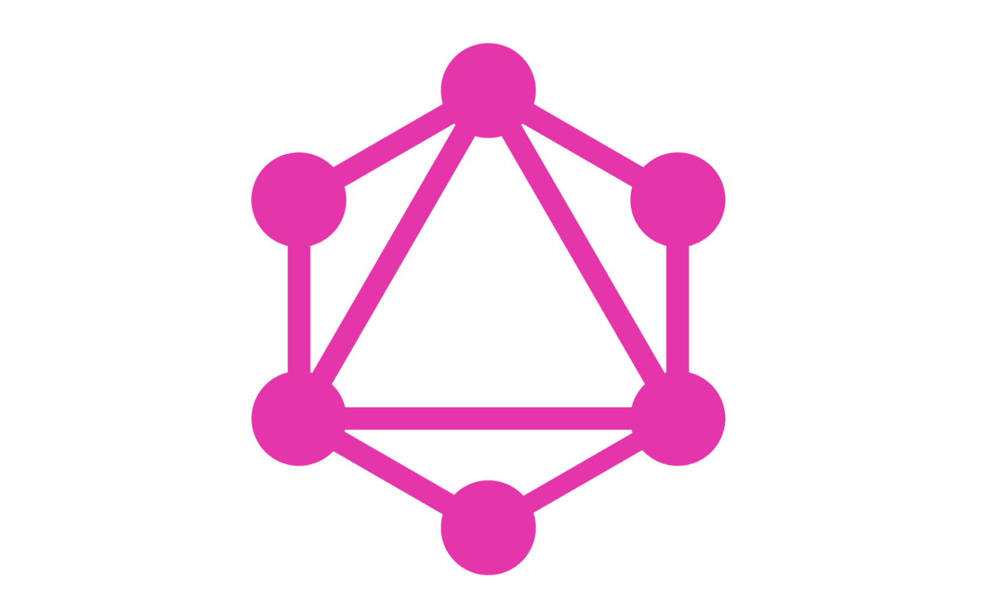

# Hi, I am Nwabueze.
Software Engineer with a passion for developing innovative programs that expedite the efficiency and effectiveness of organizational success.

                                                                                         

 

        .          

<!--
**ezego1/ezego1** is a ✨ _special_ ✨ repository because its `README.md` (this file) appears on your GitHub profile.

Here are some ideas to get you started:

- 🔭 I’m currently working on ...
- 🌱 I’m currently learning ...
- 👯 I’m looking to collaborate on ...
- 🤔 I’m looking for help with ...
- 💬 Ask me about ...
- 📫 How to reach me: ...
- 😄 Pronouns: ...
- ⚡ Fun fa
